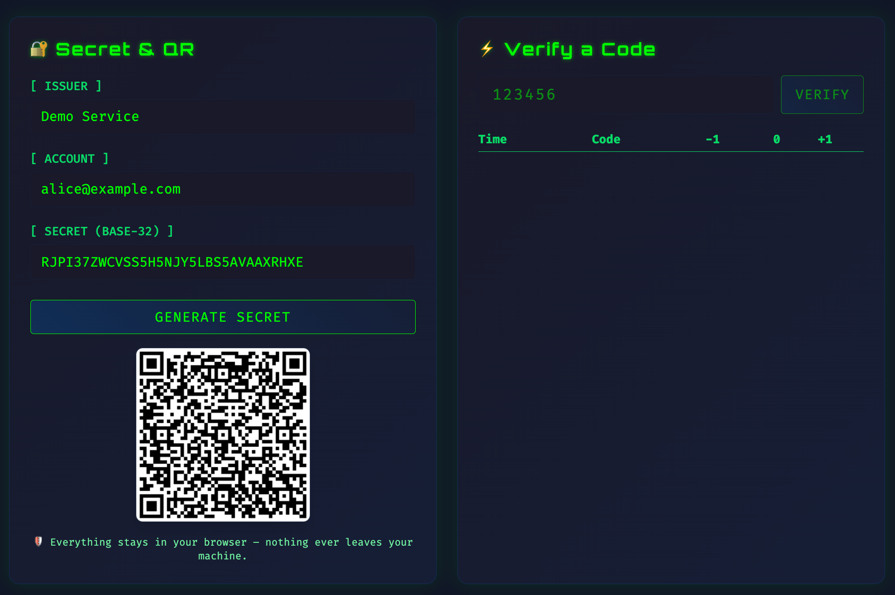

# 🔐 TOTP Playground: Because Apparently We Need 47 Dependencies to Generate 6 Numbers

_A completely over-engineered, React-based shrine to the ancient art of generating six random digits every 30 seconds._

Welcome, brave soul, to yet another JavaScript framework demonstration that definitely couldn't have been a simple HTML file with 20 lines of vanilla JS. But no, we had to use React, Vite, Tailwind, ESLint, and probably sacrifice a small goat to the npm gods to make this work.

## 🎭 What Fresh Hell Is This?

This is a TOTP (Time-based One-Time Password) playground. You know, those 6-digit codes that your phone spits out every 30 seconds that you frantically type before they expire, making you feel like you're defusing a bomb in a Michael Bay movie.

## 📸 Behold! Our Masterpiece (Screenshots)

_"A picture is worth a thousand words, but our code is worth a thousand sighs"_



_Look upon our works, ye mighty, and... well, it generates numbers. Revolutionary stuff._

This is what 500MB of dependencies and countless hours of React debugging looks like when rendered in a browser. Notice the beautiful Tailwind-styled buttons that could have been accomplished with 3 lines of CSS, and the QR code that makes your phone beep at you.

### Features That Will Change Your Life (Narrator: They Won't)

- 🔐 **Generate TOTP Secrets**: Because manually typing random characters is so 2010
- 📱 **QR Code Generation**: For when you need a pixelated square to tell your phone what numbers to show
- ✅ **Code Verification**: Test codes with a thrilling ±30 second time window (edge-of-your-seat stuff)
- 💾 **Local Storage**: We'll remember your secrets... in the least secure way possible
- 🔒 **Privacy First**: Nothing leaves your browser (mainly because we forgot to add analytics)
- ⚡ **Lightning Fast**: Thanks to Vite, now you can waste time 87% faster
- 🎨 **Modern UI**: We used Tailwind because writing CSS is apparently a war crime now

## 🚀 Getting Started (Buckle Up)

### Prerequisites (AKA The Usual Suspects)

- Node.js (because running JavaScript outside browsers seemed like a good idea)
- npm (or yarn, if you're feeling fancy)
- A deep sense of existential dread (optional but recommended)
- Coffee ☕ (mandatory)

### Installation (The Ritual)

1. Clone this monument to modern web development:

```bash
git clone [this-repo] # Replace with actual URL, we're not psychic
cd totp-website
```

2. Sacrifice your bandwidth to the npm gods:

```bash
npm install
# Watch as 500MB of node_modules appears like magic
# Wonder why a TOTP generator needs 47 transitive dependencies
```

3. Start the development server (and pray):

```bash
npm run dev
# Marvel as it takes 3 seconds to compile something that could've been static HTML
```

4. Navigate to `http://localhost:5173` and witness the glory

## 🎪 How to Use This Magnificent Beast

### Setting Up TOTP (The "Easy" Part)

1. **Configure Issuer and Account**: Type some words in boxes
2. **Generate Secret**: Click a button to get random letters (revolutionary!)
3. **Scan QR Code**: Point your phone at the screen like you're taking a selfie with pixels

### Verifying Codes (The Thrilling Conclusion)

1. **Enter Code**: Type 6 numbers (harder than it sounds)
2. **Click Verify**: Experience the rush of validation
3. **Marvel at Results**: Green ✓ means you can count, red ✗ means... well, you tried

## 🏗️ Technology Stack (Our Tower of Babel)

- **React 19**: Because class components are apparently cursed now
- **Vite**: The build tool that makes other build tools feel bad about themselves
- **Tailwind CSS**: For when you want CSS but don't actually want to write CSS
- **OTPAuth**: The one library here that actually does something useful
- **qrcode**: Turns data into pretty squares
- **A Prayer**: That this doesn't break in production

## 📁 Project Structure (Organized Chaos)

```
src/
├── features/totp/           # Because everything needs to be a "feature" now
│   ├── components/         # UI components (fancy divs)
│   ├── context/           # React Context (global variables with extra steps)
│   └── hooks/             # Custom hooks (functions but make it React)
├── assets/                # Static files feeling lonely
└── App.jsx               # The god component that rules them all
```

## 🚧 Building for Production (Good Luck)

```bash
npm run build
# Creates a `dist` folder with optimized files
# Still probably larger than the entire Doom game
```

## 🚀 Deployment (Sharing the Pain)

This project includes a GitHub Action that automatically deploys to GitHub Pages, because manually uploading files is apparently too simple for modern web development.

### Automatic Deployment (Set It and Forget It)

1. **Push to main branch**: The GitHub Action will trigger automatically
2. **Wait for the magic**: Watch the workflow turn 500MB of dependencies into a static site
3. **Visit your site**: Available at `https://yourusername.github.io/totp-website/`

### Manual Deployment (For Control Freaks)

You can also trigger deployment manually:

1. Go to the "Actions" tab in your GitHub repo
2. Click on "Deploy TOTP Playground to GitHub Pages (Probably)"
3. Click "Run workflow"
4. Cross your fingers and hope for the best

**Note**: Make sure GitHub Pages is enabled in your repository settings and set to deploy from GitHub Actions. Because apparently we need to configure static hosting now.

## 🛡️ Security & Privacy (LOL)

Don't worry, this app is totally secure:

- Everything runs in your browser (because client-side security is foolproof)
- We store secrets in localStorage (basically Fort Knox)
- No external servers (mainly because we're too lazy to set them up)
- Perfect for testing (and absolutely nothing else)

## 🤝 Contributing (Misery Loves Company)

Found a bug? Want to add more dependencies? Feel free to:

1. Fork this repo (spread the chaos)
2. Add more frameworks (because we clearly don't have enough)
3. Write tests (just kidding, nobody does that)
4. Submit a PR (and wait for the heat death of the universe for review)

## 📜 License

See LICENSE file for legal mumbo jumbo that basically says "use this at your own risk and don't sue us if it breaks everything you love."

## 🎯 FAQ (Frequently Avoided Questions)

**Q: Why did you build this?**
A: Someone said "it would be easy" and we took that personally.

**Q: Could this have been simpler?**
A: Absolutely, but then how would we justify our computer science degrees?

**Q: Is this production ready?**
A: If by "production ready" you mean "probably won't set your computer on fire," then sure.

**Q: Why is this README so sarcastic?**
A: After debugging React for 6 hours to display 6 numbers, sarcasm is a coping mechanism.

**Q: Why does the deployment take so long?**
A: GitHub's servers need time to process our architectural choices and make peace with them.

---

_Built with ❤️, tears, and an unhealthy amount of Stack Overflow copy-pasting._

_"It works on my machine" ™_
